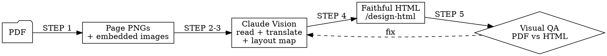
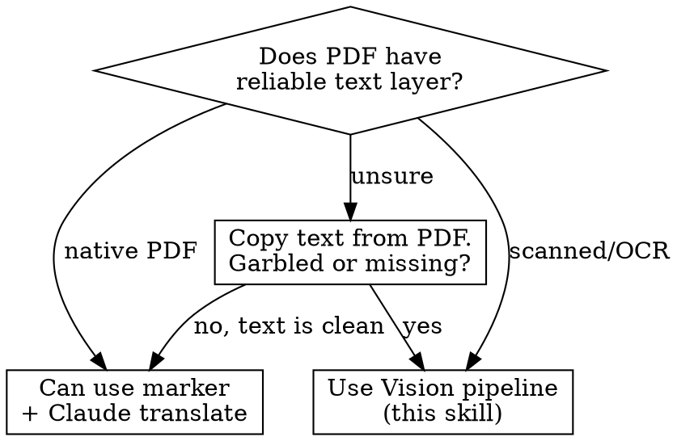

# PDF Translate

Translate a PDF into another language and produce an HTML document that preserves the original layout, images, and visual style. Optimized for OCR/image-based PDFs where the text layer is unreliable.

## Pipeline



## STEP 0: Dependencies

Check before starting. Install what's missing.

```bash
# Option A: poppler (lighter)
command -v pdftoppm && echo "OK" || echo "INSTALL: sudo apt install poppler-utils"

# Option B: PyMuPDF (more powerful — extracts embedded images with coordinates)
python3 -c "import fitz; print('OK')" 2>/dev/null || echo "INSTALL: pip install pymupdf"
```

Prefer PyMuPDF if both available — it extracts embedded images + gives page dimensions.

## STEP 1: PDF → Page Images + Embedded Assets

```bash
# Create working directory
mkdir -p pdf-translate-work/{pages,assets}

# Convert pages to high-res PNGs
pdftoppm -png -r 300 input.pdf pdf-translate-work/pages/page
# OR with PyMuPDF:
python3 -c "
import fitz
doc = fitz.open('input.pdf')
for i, page in enumerate(doc):
    pix = page.get_pixmap(dpi=300)
    pix.save(f'pdf-translate-work/pages/page-{i+1:03d}.png')
    for img_idx, img in enumerate(page.get_images(full=True)):
        xref = img[0]
        base = doc.extract_image(xref)
        with open(f'pdf-translate-work/assets/img-p{i+1}-{img_idx+1}.{base[\"ext\"]}', 'wb') as f:
            f.write(base['image'])
"
```

## STEP 2: First Pass — Style Analysis

Read page 1 (and optionally 2-3 more) with Claude Vision. Extract:

- **Typography**: font style (serif/sans), heading sizes, body size, weight
- **Colors**: background, text, accent, header colors
- **Layout**: single/multi column, margins, header/footer pattern
- **Spacing**: line height, paragraph gaps, section gaps
- **Special elements**: callout boxes, sidebars, tables, captions, footnotes

Output a style brief — this feeds into STEP 4.

## STEP 3: Page-by-Page Read + Translate

For each page image, use Claude Vision (Read tool on PNG):

1. **Read** the text content from the image (ignore OCR text layer)
2. **Map layout**: identify text blocks, headings, images, tables, their relative positions
3. **Translate** to target language preserving:
   - Register and tone (formal/informal/technical)
   - Technical terms (keep original in parentheses on first occurrence if ambiguous)
   - Sentence structure adapted to target language (not word-for-word)
4. **Note** image references: what each image shows, where it sits relative to text

### Cross-page context

Maintain a running glossary of translated terms across pages. If page 1 translates "stakeholder" as "partie prenante", every subsequent page must use the same term.

Output per page:
```markdown
## Page N

### Layout
[column structure, image positions]

### Content (translated)
[translated text with markdown structure]

### Images
- img-pN-1.png: [description], position: [top-right / inline / full-width]
```

## STEP 4: HTML Reconstruction

Invoke `/design-html` (or `/frontend-design`) with:

1. The style brief from STEP 2
2. All translated page content from STEP 3
3. Extracted images from `pdf-translate-work/assets/`

Requirements for the HTML:
- Single self-contained HTML file (inline CSS, base64 images or relative paths)
- Match original typography feel (use closest web-safe or Google Font)
- Preserve column layout, spacing, color scheme
- Images at original positions with proper sizing
- Print-friendly: `@media print` styles, page breaks where original had them
- Responsive: readable on screen, faithful on print

## STEP 5: Visual QA

Compare original PDF and translated HTML side by side:

1. Read a few pages of the original PDF (Read tool, pages parameter)
2. Take screenshot of the HTML (if /browse available)
3. Check: layout match, no missing content, images present, style fidelity
4. Fix discrepancies → iterate STEP 4

## Decision: OCR vs Native PDF



If the PDF has a clean text layer, `marker` (pip install marker-pdf) is faster. This skill's Vision pipeline is for when the text layer is unreliable.

## Common Mistakes

| Mistake | Fix |
|---|---|
| Using OCR text layer from scanned PDF | Read page images with Vision instead |
| Translating page-by-page without glossary | Maintain cross-page term consistency |
| Generic HTML that doesn't match original style | Extract style brief first (STEP 2) |
| Word-for-word translation | Adapt sentence structure to target language |
| Forgetting `prefers-reduced-motion` or print styles | Include in HTML output |
| Images as decoration only | Preserve original placement and sizing |
